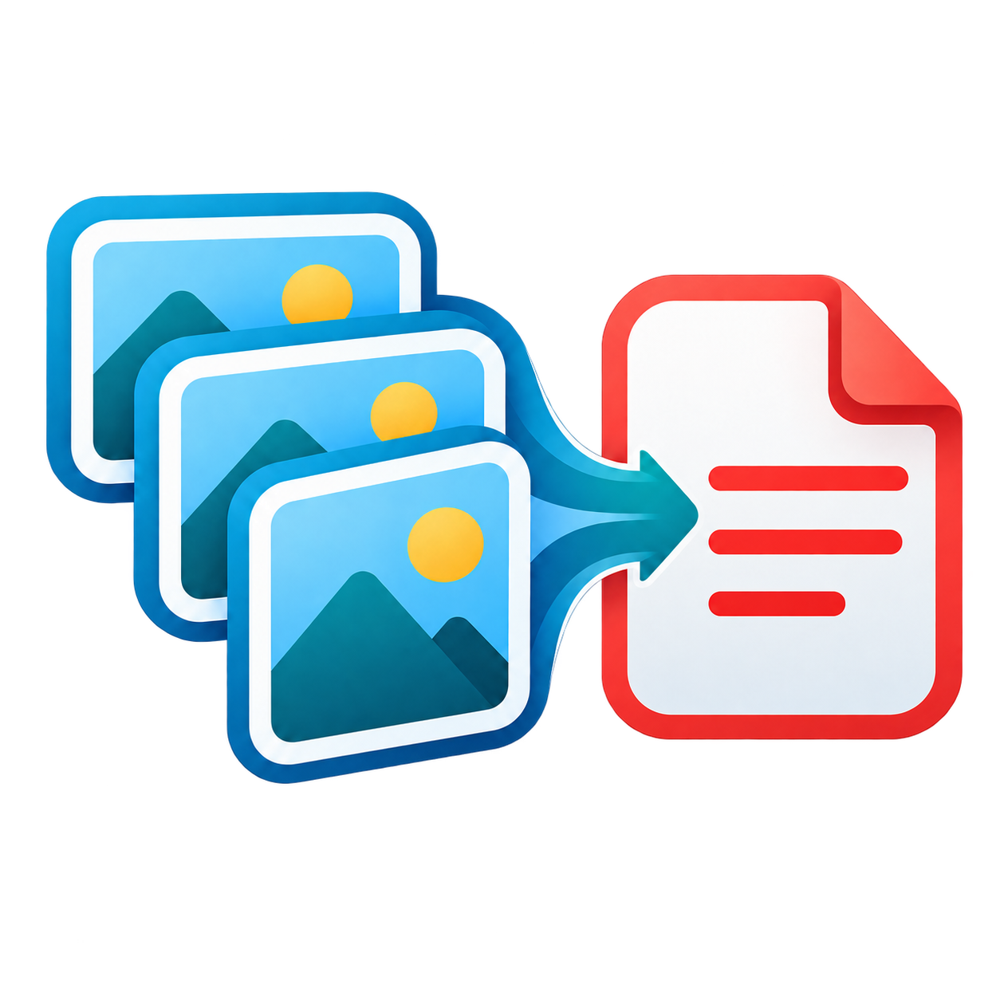
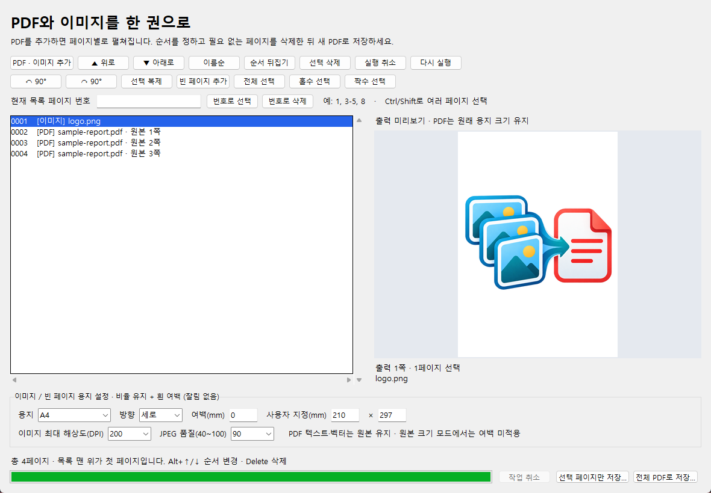

# ImageToPDF 2.0 · PDF와 이미지를 한 권으로

<p align="center"></p>

Windows에서 **PDF 병합, 페이지 삭제·추출, 이미지의 용지 맞춤**을 한 창에서 처리합니다. 파일 처리는 PC 안에서 이루어집니다.

**[최신 버전 다운로드](https://github.com/yjw071218/image-to-pdf/releases/latest)**



## 설치

- **ImageToPDF-Setup-2.1.1-x64.exe**: 권장. 프로그램, PDF/이미지 우클릭 메뉴, 시작 메뉴와 바탕화면 바로가기를 설치합니다. 기존 설치판을 업데이트할 수 있습니다. 업데이트 전에 기존 창에서 작업을 저장하고 닫아 주세요.
- **ImageToPDF-Portable-2.1.1-x64.zip**: 압축을 풀고 `ImageToPDF.exe` 실행. 우클릭 메뉴를 자동 등록하지 않습니다.
- Windows 10/11 64비트. Python 설치 및 관리자 권한 불필요. 코드 서명되지 않은 배포 파일이며, SHA-256 해시는 릴리스의 `SHA256SUMS.txt`에서 확인할 수 있습니다.

## PDF 병합 / 이미지와 PDF 섞기

1. 탐색기에서 PDF 또는 이미지를 선택 → 우클릭 → **더 많은 옵션 표시 → PDF·이미지 엮기 / 페이지 편집**. 프로그램의 **PDF · 이미지 추가**도 사용할 수 있습니다.
2. PDF는 페이지별로 목록에 펼쳐집니다. 목록 맨 위가 출력의 첫 페이지입니다.
3. Ctrl/Shift로 선택하고 **▲/▼** 또는 **Alt+↑/↓**로 순서를 조정합니다.
4. **전체 PDF로 저장…**을 눌러 새 파일로 저장합니다.

같은 파일의 중복 추가는 방지합니다. 같은 페이지가 다시 필요하면 **선택 복제**를 사용하세요. 처음 불러온 파일 묶음은 이름순이며, 탐색기 클릭 순서를 보장하지 않습니다. **이름순** 버튼으로 파일 이름 및 원본 페이지 순서대로 다시 정렬할 수 있습니다.

## 특정 페이지 삭제 / 필요한 페이지만 추출

- 삭제: 목록에서 페이지 선택 → **선택 삭제** 또는 Delete.
- 번호로 삭제: **현재 목록 페이지 번호**에 `1, 3-5, 8` 입력 → **번호로 삭제**.
- 추출: 페이지 선택 → **선택 페이지만 저장…**. 선택한 페이지가 현재 목록 순서대로 저장됩니다.
- 번호는 **현재 목록 왼쪽의 출력 순번**입니다. 파일 이름 옆의 **원본 N쪽**은 원래 PDF의 페이지를 뜻합니다.
- **실행 취소 / 다시 실행**으로 목록 편집을 50단계까지 되돌립니다. 목록에 포커스가 있을 때 Ctrl+Z / Ctrl+Y도 사용할 수 있습니다.

원본 PDF는 덮어쓸 수 없습니다. 삭제·회전 등은 새 PDF로 저장해야 반영됩니다.

## 용지와 여백

| 설정 | 동작 |
| --- | --- |
| 기본값 A4 / 세로 / 여백 0mm | 이미지 전체를 A4 안에 최대한 크게 배치하고 비율 차이는 흰 여백으로 채움 |
| A3, A5, B4/B5 (ISO), Letter, Legal | 선택한 실제 용지 크기로 이미지 페이지 생성 |
| 사용자 지정 | 가로·세로 10~2000mm, 방향에 따라 긴 변과 짧은 변 배치 |
| 세로 / 가로 / 자동 | 자동은 회전이 반영된 이미지의 가로·세로에 맞춰 페이지 방향 결정 |
| 여백(mm) | 용지 네 변의 최소 여백. 남은 공간에 이미지를 가운데 정렬 |
| 원본 크기 | 이미지 픽셀 수와 DPI로 페이지 크기 결정. 추가 여백 미적용 |
| DPI / JPEG 품질 | 이미지 최대 해상도와 압축 품질 조절. 작은 이미지는 불필요하게 재샘플링하지 않음 |

**이미지를 자르거나 가로·세로 비율을 늘리지 않습니다.** 가로로 긴 이미지는 위아래에, 세로로 긴 이미지는 좌우에 여백이 생깁니다. 화면의 미리보기에서 출력 모양을 확인할 수 있습니다.

용지 설정은 **이미지와 빈 페이지**에 적용됩니다. 기존 PDF는 원래 페이지 크기와 텍스트·벡터를 유지합니다. PDF를 이미지로 재압축하지 않습니다. 용지 설정은 다음 실행에도 유지됩니다.

## 추가 기능

- 선택 페이지 90° 회전, 복제, 빈 페이지 삽입, 순서 뒤집기
- 전체 / 홀수 / 짝수 / 번호 범위 선택
- PDF 페이지 및 용지 여백 미리보기
- 여러 페이지 TIFF 전체 가져오기
- 암호를 알고 있는 PDF 열기 (AES 포함). 암호는 메모리에만 보관하며 저장 결과는 암호화되지 않습니다.
- 백그라운드 가져오기·저장, 진행 표시와 작업 취소
- 저장 실패·취소 시 기존 출력 파일 보존. 원본 파일 덮어쓰기 방지

## 지원 및 제한

- PDF, JPG/JPEG, PNG, BMP, GIF, TIF/TIFF, WebP. 애니메이션 GIF/WebP는 첫 프레임, TIFF는 전체 프레임을 사용합니다.
- 투명 이미지는 흰 배경으로 처리하며 EXIF 회전을 반영합니다.
- PDF의 문서 수준 북마크·첨부·서명·암호화 설정은 새 파일에 승계하지 않습니다. 일반 페이지 내용과 텍스트를 중심으로 병합하며 복잡한 양식·내부 링크는 결과를 확인하세요.
- 우클릭 메뉴는 Windows 11의 **더 많은 옵션 표시**에 나타납니다. 한 번에 최대 100개 파일 선택을 지원하며, 더 많은 파일은 프로그램의 추가 버튼을 이용하세요. [Windows 메뉴 선택 모델](https://learn.microsoft.com/en-us/windows/win32/shell/how-to-employ-the-verb-selection-model).
- 큰 파일은 페이지 처리에 시간이 걸릴 수 있습니다. 취소는 현재 페이지 처리가 끝난 뒤 반영됩니다.

## 설치 위치 / 제거

기본 설치 위치는 `%LOCALAPPDATA%\Programs\ImageToPDF`입니다. **Windows 설정 → 앱 → 설치된 앱 → ImageToPDF → 제거**에서 프로그램과 우클릭 메뉴를 제거합니다.

사용자 설정은 `%LOCALAPPDATA%\ImageToPDF\settings.json`, 탐색기 실행 요청은 같은 폴더의 `inbox-v2`에 저장합니다. 실행 요청은 읽으면 삭제합니다. 같은 사용자의 2.x 설치판·무설치판은 하나의 창을 공유합니다. 1.x와는 별도 창으로 실행됩니다.

## 개발 및 빌드

64비트 Python 3.10 이상, Windows, [Inno Setup](https://jrsoftware.org/isinfo.php)이 필요합니다.

```powershell
python -m venv .venv
.\.venv\Scripts\python.exe -m pip install -r requirements.txt
.\.venv\Scripts\python.exe app.py
# 회귀 테스트: 실행 중인 앱과 분리된 세션 사용
.\.venv\Scripts\python.exe app.py --self-test tools\source-report.json
# 설치 EXE + 무설치 ZIP + SHA256SUMS 생성
.\build.ps1 -InnoCompiler 'C:\path\to\ISCC.exe'
```

소스용 우클릭 메뉴 등록: `.\.venv\Scripts\python.exe setup.py`. 해제: `--uninstall` 추가. 소스 등록은 설치판 메뉴를 대체하므로 설치판과 함께 등록하지 마세요.

구조: `app.py` 실행/단일 인스턴스, `ui.py` 페이지 편집, `pdf_engine.py` 변환/병합 엔진. 테스트 결과와 범위는 [VALIDATION.md](VALIDATION.md)를 참고하세요.

## 라이선스

[MIT](LICENSE). 번들 런타임·라이브러리의 라이선스는 설치 폴더 `_internal/third-party-licenses`에 포함합니다. 로고 원본과 생성 프롬프트는 [assets](assets/README.md)에 있습니다.
